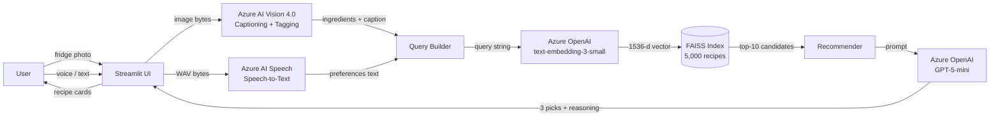

# System Architecture

## Data Flow

## Service justification

| Service | Why this, not an alternative |
|---|---|
| **Azure AI Vision 4.0** | The `Image Analysis` API gives Caption + Tags in one call. Tags align well with food nouns (apple, carrot, beef) and are more robust to varied fridge lighting than custom-trained object detection. Captioning gives the LLM extra context. Reuses the `sit788cv2srbwq` F0 account already provisioned for Task 9.2C, demonstrating asset reuse across the trimester. |
| **Azure AI Speech** | Single-shot recognition is enough for the 5–10 s voice queries this demo uses. Region-locked to `australiaeast` for low latency from Melbourne. |
| **Azure OpenAI text-embedding-3-small** | 1536-d, $0.02 / 1M tokens, indexes 5,000 recipes for ~$0.008. Used for both index build and per-query embedding so the vector space is consistent. |
| **FAISS (local) instead of Azure AI Search** | At 5,000 vectors the index is ~30 MB; a flat inner-product index gives exact cosine similarity in sub-millisecond time. Managed Azure AI Search would add ~75 ms per query and a $75/mo minimum tier with no benefit at this scale. The trade-off is documented as a deliberate engineering choice, not an oversight. For a production deployment with >100k vectors the calculus would flip. |
| **Azure OpenAI GPT-5-mini** | Cheapest non-deprecated chat model in the Azure OpenAI catalog (gpt-4o-mini was deprecated 2026-03-31). Supports JSON-mode for structured output. The recommendation task is reasoning over ~10 small candidate descriptions — does not warrant a frontier model. |

## Why a 3-stage funnel (ingredient extraction → semantic retrieval → LLM rerank)

A single LLM call given just the user's ingredients would either:
- Hallucinate recipes that don't exist in any cookbook (no grounding), or
- Need the full 5,000-recipe corpus in-context, which is impossible.

A retrieval-only system would surface candidates by lexical/semantic similarity but cannot apply the user's *preferences* (vegetarian, time-bound, etc.) — those constraints don't embed cleanly.

The two-stage retrieval-then-rerank approach solves both: FAISS recall finds the plausible 10, then GPT-5-mini applies the soft preference filter and explains its picks. Cost stays bounded (10 candidates is well within the model's effective attention window), and every recommendation is traceable back to a real recipe ID in the indexed corpus.
