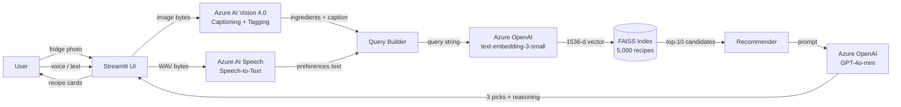

# Recipe Recommender ("What's in my fridge?") — Implementation Plan

> **For agentic workers:** REQUIRED SUB-SKILL: Use superpowers:subagent-driven-development (recommended) or superpowers:executing-plans to implement this plan task-by-task. Steps use checkbox (`- [ ]`) syntax for tracking.

**Goal:** Build a multimodal recommendation bot that takes a photo of a fridge plus a voice or text query and returns three ranked recipe recommendations using Azure AI services. Submitted as SIT788 Task 11.2HD.

**Architecture:** A single-process Streamlit app that pipelines four Azure AI services — Azure AI Vision 4.0 (image → ingredient tags), Azure AI Speech (audio → text), Azure OpenAI text-embedding-3-small (recipe + query embeddings, indexed in a local FAISS store), and Azure OpenAI GPT-4o-mini (final recommendation reasoning over retrieved candidates). The recipe corpus is a 5,000-row sample of the Food.com Recipes Kaggle dataset, pre-embedded at build time. The app runs locally for the Panopto demo — no hosted endpoint is required for the assignment.

**Tech Stack:** Python 3.11, Streamlit, FAISS (faiss-cpu), Azure SDKs (`azure-ai-vision-imageanalysis`, `azure-cognitiveservices-speech`, `openai` with Azure endpoint), pandas, python-dotenv, pytest. Azure resources provisioned via `az` CLI.

**Deadline:** 2026-05-31 20:00 AEST. Today is 2026-05-24. **7 days, single submission attempt.**

**Submission deliverables (from task sheet):**
- Project report PDF (purpose, dataset, architecture flowchart, service justification, code screenshots, recommendation logic explanation)
- Source code zip
- Panopto video demo (link in PDF)

---

## File Structure

```
11.2HD/
├── README.md                        # Quickstart + how to run demo
├── requirements.txt                 # Pinned Python deps
├── .env.example                     # Template — never commit real .env
├── .gitignore
├── infra/
│   └── provision.sh                 # az CLI commands to create all Azure resources
├── data/
│   ├── download_dataset.py          # Pull + sample Food.com recipes
│   ├── build_index.py               # Embed sample, save FAISS index + metadata
│   └── recipes_sample.csv           # 5k-row sample (committed, ~10 MB)
├── src/
│   ├── __init__.py
│   ├── config.py                    # Load env, expose Azure clients
│   ├── vision.py                    # image bytes -> List[str] ingredient tags
│   ├── speech.py                    # audio bytes -> str transcript
│   ├── retrieval.py                 # query text -> top-k recipe candidates
│   ├── recommender.py               # ingredients + prefs + candidates -> 3 recommendations
│   └── app.py                       # Streamlit UI tying it all together
├── tests/
│   ├── test_retrieval.py            # business logic, no Azure calls
│   ├── test_recommender.py          # prompt assembly, with mocked LLM
│   └── test_vision_smoke.py         # smoke test that hits real Azure (skip in CI)
├── docs/
│   ├── architecture.md              # Mermaid flowchart + service justification
│   ├── architecture.png             # Exported flowchart for report
│   └── report.md                    # Final report draft (markdown → PDF)
└── artifacts/
    ├── index.faiss                  # Vector index (built at setup, ~50 MB)
    └── recipes_meta.parquet         # Recipe metadata aligned to index rows
```

---

## Task 0: Project Skeleton + Git Init

**Files:**
- Create: `.gitignore`, `requirements.txt`, `.env.example`, `README.md`

- [ ] **Step 1: Create `.gitignore`**

```
.env
.venv/
__pycache__/
*.pyc
.pytest_cache/
artifacts/index.faiss
artifacts/recipes_meta.parquet
data/raw/
.DS_Store
*.egg-info/
```

- [ ] **Step 2: Create `requirements.txt`**

```
streamlit==1.40.2
azure-ai-vision-imageanalysis==1.0.0
azure-cognitiveservices-speech==1.42.0
openai==1.59.7
faiss-cpu==1.9.0
pandas==2.2.3
pyarrow==18.1.0
python-dotenv==1.0.1
pytest==8.3.4
kaggle==1.6.17
Pillow==11.0.0
numpy==2.1.3
tenacity==9.0.0
```

- [ ] **Step 3: Create `.env.example`**

```
# Azure AI Vision
AZURE_VISION_ENDPOINT=https://<your-vision-resource>.cognitiveservices.azure.com/
AZURE_VISION_KEY=

# Azure Speech
AZURE_SPEECH_KEY=
AZURE_SPEECH_REGION=australiaeast

# Azure OpenAI
AZURE_OPENAI_ENDPOINT=https://<your-openai-resource>.openai.azure.com/
AZURE_OPENAI_KEY=
AZURE_OPENAI_API_VERSION=2024-10-21
AZURE_OPENAI_CHAT_DEPLOYMENT=gpt-4o-mini
AZURE_OPENAI_EMBED_DEPLOYMENT=text-embedding-3-small
```

- [ ] **Step 4: Create `README.md` (placeholder, expanded in Task 14)**

```markdown
# What's in My Fridge? — Multimodal Recipe Recommender

SIT788 Task 11.2HD — Capstone submission.

See `docs/report.md` for the full report and `docs/architecture.md` for the system diagram.

## Quickstart
1. `python -m venv .venv && source .venv/bin/activate`
2. `pip install -r requirements.txt`
3. Copy `.env.example` to `.env` and fill in Azure keys (see `infra/provision.sh`)
4. `python data/download_dataset.py && python data/build_index.py`
5. `streamlit run src/app.py`
```

- [ ] **Step 5: Create venv and install**

```bash
cd "/Users/Shared/Files From i.localized/Files/Deakin/Engineering AI Solutions/Week 11/11.2HD"
python3 -m venv .venv
source .venv/bin/activate
pip install -r requirements.txt
```

- [ ] **Step 6: Commit**

```bash
git add .gitignore requirements.txt .env.example README.md
git commit -m "scaffold project skeleton"
```

---

## Task 1: Provision Azure Resources

**Files:**
- Create: `infra/provision.sh`

Cognitive Services + Speech + OpenAI all live under the `Microsoft.CognitiveServices` provider. Vision and Speech work in `australiaeast`; OpenAI is created in `eastus` for highest chance of GPT-4o-mini and embeddings quota under the Deakin lab subscription.

- [ ] **Step 1: Write `infra/provision.sh`**

```bash
#!/usr/bin/env bash
set -euo pipefail

RG=sit788-11-2hd-rg
LOC_AU=australiaeast
LOC_US=eastus
STUDENT_ID=s225048421
VISION_NAME=sit788-${STUDENT_ID}-vision
SPEECH_NAME=sit788-${STUDENT_ID}-speech
OPENAI_NAME=sit788-${STUDENT_ID}-openai

echo "Creating resource group..."
az group create -n "$RG" -l "$LOC_AU" >/dev/null

echo "Creating Azure AI Vision (Computer Vision)..."
az cognitiveservices account create \
  -g "$RG" -n "$VISION_NAME" \
  --kind ComputerVision --sku S1 -l "$LOC_AU" --yes >/dev/null

echo "Creating Azure Speech..."
az cognitiveservices account create \
  -g "$RG" -n "$SPEECH_NAME" \
  --kind SpeechServices --sku S0 -l "$LOC_AU" --yes >/dev/null

echo "Creating Azure OpenAI..."
az cognitiveservices account create \
  -g "$RG" -n "$OPENAI_NAME" \
  --kind OpenAI --sku S0 -l "$LOC_US" --yes >/dev/null

echo "Deploying GPT-4o-mini..."
az cognitiveservices account deployment create \
  -g "$RG" -n "$OPENAI_NAME" \
  --deployment-name gpt-4o-mini \
  --model-name gpt-4o-mini --model-version "2024-07-18" \
  --model-format OpenAI --sku-capacity 30 --sku-name "Standard"

echo "Deploying text-embedding-3-small..."
az cognitiveservices account deployment create \
  -g "$RG" -n "$OPENAI_NAME" \
  --deployment-name text-embedding-3-small \
  --model-name text-embedding-3-small --model-version "1" \
  --model-format OpenAI --sku-capacity 30 --sku-name "Standard"

echo
echo "==== Copy these into your .env ===="
echo "AZURE_VISION_ENDPOINT=$(az cognitiveservices account show -g "$RG" -n "$VISION_NAME" --query properties.endpoint -o tsv)"
echo "AZURE_VISION_KEY=$(az cognitiveservices account keys list -g "$RG" -n "$VISION_NAME" --query key1 -o tsv)"
echo "AZURE_SPEECH_KEY=$(az cognitiveservices account keys list -g "$RG" -n "$SPEECH_NAME" --query key1 -o tsv)"
echo "AZURE_SPEECH_REGION=$LOC_AU"
echo "AZURE_OPENAI_ENDPOINT=$(az cognitiveservices account show -g "$RG" -n "$OPENAI_NAME" --query properties.endpoint -o tsv)"
echo "AZURE_OPENAI_KEY=$(az cognitiveservices account keys list -g "$RG" -n "$OPENAI_NAME" --query key1 -o tsv)"
```

- [ ] **Step 2: Run it and populate `.env`**

```bash
chmod +x infra/provision.sh
./infra/provision.sh
# Copy the printed key=value lines into .env (do NOT commit .env)
cp .env.example .env
# Edit .env, paste in the values
```

Expected: 5 minutes of provisioning, ends with six env values printed.

**Fallback if OpenAI quota fails:** The Deakin lab subscription may lack OpenAI access in `eastus`. Try `swedencentral` or `australiaeast` next. If all fail, request quota via the Azure portal (instant for student subs in most regions) **OR** swap to Azure AI Foundry's serverless deployment of `Phi-3.5-mini-instruct` and `text-embedding-3-large` — the rest of the code is provider-agnostic since the `openai` Python SDK targets any OpenAI-compatible endpoint.

- [ ] **Step 3: Smoke-test the OpenAI deployment**

```bash
source .venv/bin/activate
python -c "
from openai import AzureOpenAI
import os; from dotenv import load_dotenv; load_dotenv()
c = AzureOpenAI(
  azure_endpoint=os.environ['AZURE_OPENAI_ENDPOINT'],
  api_key=os.environ['AZURE_OPENAI_KEY'],
  api_version=os.environ['AZURE_OPENAI_API_VERSION'],
)
r = c.chat.completions.create(
  model=os.environ['AZURE_OPENAI_CHAT_DEPLOYMENT'],
  messages=[{'role':'user','content':'reply with the word pong'}],
  max_tokens=5)
print(r.choices[0].message.content)
"
```

Expected output: `pong`

- [ ] **Step 4: Commit**

```bash
git add infra/provision.sh
git commit -m "add Azure provisioning script"
```

---

## Task 2: Config Module

**Files:**
- Create: `src/__init__.py` (empty), `src/config.py`

- [ ] **Step 1: Write `src/config.py`**

```python
"""Central config: loads .env once and exposes Azure clients."""
from __future__ import annotations
import os
from functools import lru_cache
from dotenv import load_dotenv

load_dotenv()


def _require(key: str) -> str:
    val = os.environ.get(key)
    if not val:
        raise RuntimeError(f"Missing env var: {key}. Check .env.")
    return val


class Settings:
    vision_endpoint = _require("AZURE_VISION_ENDPOINT")
    vision_key = _require("AZURE_VISION_KEY")
    speech_key = _require("AZURE_SPEECH_KEY")
    speech_region = _require("AZURE_SPEECH_REGION")
    openai_endpoint = _require("AZURE_OPENAI_ENDPOINT")
    openai_key = _require("AZURE_OPENAI_KEY")
    openai_api_version = os.environ.get("AZURE_OPENAI_API_VERSION", "2024-10-21")
    chat_deployment = os.environ.get("AZURE_OPENAI_CHAT_DEPLOYMENT", "gpt-4o-mini")
    embed_deployment = os.environ.get("AZURE_OPENAI_EMBED_DEPLOYMENT", "text-embedding-3-small")


@lru_cache
def openai_client():
    from openai import AzureOpenAI
    s = Settings()
    return AzureOpenAI(
        azure_endpoint=s.openai_endpoint,
        api_key=s.openai_key,
        api_version=s.openai_api_version,
    )


@lru_cache
def vision_client():
    from azure.ai.vision.imageanalysis import ImageAnalysisClient
    from azure.core.credentials import AzureKeyCredential
    s = Settings()
    return ImageAnalysisClient(endpoint=s.vision_endpoint, credential=AzureKeyCredential(s.vision_key))
```

- [ ] **Step 2: Commit**

```bash
git add src/__init__.py src/config.py
git commit -m "add config module with cached Azure clients"
```

---

## Task 3: Download + Sample the Recipe Dataset

**Files:**
- Create: `data/download_dataset.py`

The full Food.com dataset is ~230k recipes. We sample 5,000 for index build speed and embedding cost. We pick recipes with non-empty ingredients and a moderate ingredient count so retrieval is realistic.

**Dataset:** Food.com Recipes and Interactions on Kaggle (`shuyangli94/food-com-recipes-and-user-interactions`). User needs Kaggle API token in `~/.kaggle/kaggle.json`.

- [ ] **Step 1: Write `data/download_dataset.py`**

```python
"""Download Food.com recipes, sample 5,000 rows, write recipes_sample.csv.

Run: python data/download_dataset.py
Prereq: Kaggle API token at ~/.kaggle/kaggle.json
"""
from __future__ import annotations
import ast
import subprocess
from pathlib import Path
import pandas as pd

ROOT = Path(__file__).resolve().parent
RAW_DIR = ROOT / "raw"
OUT_PATH = ROOT / "recipes_sample.csv"
SAMPLE_SIZE = 5000
RANDOM_SEED = 42


def download() -> Path:
    RAW_DIR.mkdir(exist_ok=True)
    csv_path = RAW_DIR / "RAW_recipes.csv"
    if csv_path.exists():
        return csv_path
    subprocess.run([
        "kaggle", "datasets", "download",
        "-d", "shuyangli94/food-com-recipes-and-user-interactions",
        "-f", "RAW_recipes.csv",
        "-p", str(RAW_DIR), "--unzip",
    ], check=True)
    return csv_path


def parse_list_str(s: str) -> list[str]:
    """Food.com stores list columns as Python-repr strings."""
    try:
        return [str(x).strip() for x in ast.literal_eval(s)]
    except (ValueError, SyntaxError):
        return []


def main() -> None:
    csv_path = download()
    df = pd.read_csv(csv_path)
    df = df.dropna(subset=["name", "ingredients", "steps"])
    df["ingredients_list"] = df["ingredients"].apply(parse_list_str)
    df["steps_list"] = df["steps"].apply(parse_list_str)
    df["n_ingredients"] = df["ingredients_list"].str.len()
    df["n_steps"] = df["steps_list"].str.len()
    df = df[(df["n_ingredients"].between(4, 15)) & (df["n_steps"].between(3, 25))]
    df = df.sample(n=SAMPLE_SIZE, random_state=RANDOM_SEED)
    keep = ["id", "name", "minutes", "ingredients_list", "steps_list", "n_ingredients", "n_steps", "description"]
    df = df[keep].reset_index(drop=True)
    df.to_csv(OUT_PATH, index=False)
    print(f"Wrote {len(df):,} recipes to {OUT_PATH}")


if __name__ == "__main__":
    main()
```

- [ ] **Step 2: Run it**

```bash
source .venv/bin/activate
python data/download_dataset.py
```

Expected: prints `Wrote 5,000 recipes to .../recipes_sample.csv`.

- [ ] **Step 3: Commit**

```bash
git add data/download_dataset.py data/recipes_sample.csv
git commit -m "sample 5k recipes from Food.com dataset"
```

(`data/raw/` is gitignored — only the sample is committed.)

---

## Task 4: Build the Embedding Index

**Files:**
- Create: `data/build_index.py`, `artifacts/.gitkeep`

We embed each recipe as `name + ingredients + first 200 chars of description`. text-embedding-3-small produces 1536-dim vectors. With 5k recipes and FAISS `IndexFlatIP` (cosine via L2-normalized vectors), search is sub-millisecond.

- [ ] **Step 1: Create `artifacts/.gitkeep`**

```bash
mkdir -p artifacts && touch artifacts/.gitkeep
```

- [ ] **Step 2: Write `data/build_index.py`**

```python
"""Embed the sampled recipes with Azure OpenAI and save a FAISS index.

Run: python data/build_index.py
Cost note: 5k recipes * ~80 tokens each = ~400k tokens
            text-embedding-3-small ~ $0.02 per 1M tokens -> < $0.01
"""
from __future__ import annotations
import sys
from pathlib import Path
import ast
import numpy as np
import pandas as pd
import faiss
from tenacity import retry, stop_after_attempt, wait_exponential

ROOT = Path(__file__).resolve().parents[1]
sys.path.insert(0, str(ROOT))
from src.config import Settings, openai_client  # noqa: E402

DATA_CSV = ROOT / "data" / "recipes_sample.csv"
INDEX_PATH = ROOT / "artifacts" / "index.faiss"
META_PATH = ROOT / "artifacts" / "recipes_meta.parquet"
BATCH = 100
EMBED_DIM = 1536


def doc_text(row: pd.Series) -> str:
    ingredients = ", ".join(ast.literal_eval(row["ingredients_list"]) if isinstance(row["ingredients_list"], str) else row["ingredients_list"])
    desc = (row["description"] or "")[:200] if isinstance(row["description"], str) else ""
    return f"{row['name']}\nIngredients: {ingredients}\n{desc}"


@retry(stop=stop_after_attempt(5), wait=wait_exponential(min=1, max=10))
def embed_batch(client, deployment: str, texts: list[str]) -> np.ndarray:
    resp = client.embeddings.create(model=deployment, input=texts)
    return np.array([d.embedding for d in resp.data], dtype="float32")


def main() -> None:
    df = pd.read_csv(DATA_CSV)
    texts = [doc_text(r) for _, r in df.iterrows()]
    client = openai_client()
    deployment = Settings.embed_deployment

    all_vecs = np.empty((len(texts), EMBED_DIM), dtype="float32")
    for i in range(0, len(texts), BATCH):
        chunk = texts[i:i + BATCH]
        all_vecs[i:i + len(chunk)] = embed_batch(client, deployment, chunk)
        print(f"  embedded {i + len(chunk):,}/{len(texts):,}")

    faiss.normalize_L2(all_vecs)
    index = faiss.IndexFlatIP(EMBED_DIM)
    index.add(all_vecs)
    faiss.write_index(index, str(INDEX_PATH))

    df.to_parquet(META_PATH, index=False)
    print(f"\nWrote {index.ntotal:,} vectors -> {INDEX_PATH}")
    print(f"Wrote metadata -> {META_PATH}")


if __name__ == "__main__":
    main()
```

- [ ] **Step 3: Run it**

```bash
source .venv/bin/activate
python data/build_index.py
```

Expected: prints batched progress and finishes with `Wrote 5,000 vectors...`. Takes 2–5 minutes.

- [ ] **Step 4: Commit**

```bash
git add data/build_index.py artifacts/.gitkeep
git commit -m "build FAISS index over 5k recipe embeddings"
```

---

## Task 5: Retrieval Module (TDD)

**Files:**
- Create: `src/retrieval.py`, `tests/test_retrieval.py`

- [ ] **Step 1: Write the failing test `tests/test_retrieval.py`**

```python
import pytest
from src.retrieval import RecipeRetriever


@pytest.fixture(scope="module")
def retriever():
    return RecipeRetriever.load_default()


def test_returns_requested_k(retriever):
    hits = retriever.search("chicken curry with rice", k=5)
    assert len(hits) == 5


def test_hits_have_required_fields(retriever):
    hits = retriever.search("chocolate cake", k=3)
    for h in hits:
        assert "name" in h and "ingredients" in h and "score" in h
        assert isinstance(h["ingredients"], list)
        assert 0.0 <= h["score"] <= 1.0


def test_ingredient_query_finds_matching_recipe(retriever):
    """A direct ingredient query should surface relevant recipes in top-10."""
    hits = retriever.search("pasta tomato garlic basil", k=10)
    names = " ".join(h["name"].lower() for h in hits)
    assert any(kw in names for kw in ["pasta", "spaghetti", "marinara", "tomato"])
```

- [ ] **Step 2: Run — should fail (module not yet present)**

```bash
source .venv/bin/activate
pytest tests/test_retrieval.py -v
```

Expected: `ModuleNotFoundError: src.retrieval`

- [ ] **Step 3: Write `src/retrieval.py`**

```python
"""Recipe retrieval over a pre-built FAISS index."""
from __future__ import annotations
import ast
from dataclasses import dataclass
from pathlib import Path
import faiss
import numpy as np
import pandas as pd
from .config import Settings, openai_client

ROOT = Path(__file__).resolve().parents[1]
INDEX_PATH = ROOT / "artifacts" / "index.faiss"
META_PATH = ROOT / "artifacts" / "recipes_meta.parquet"


def _parse_list(val) -> list[str]:
    if isinstance(val, list):
        return val
    if isinstance(val, str):
        try:
            return list(ast.literal_eval(val))
        except (ValueError, SyntaxError):
            return []
    return []


@dataclass
class RecipeRetriever:
    index: faiss.Index
    meta: pd.DataFrame

    @classmethod
    def load_default(cls) -> "RecipeRetriever":
        return cls(
            index=faiss.read_index(str(INDEX_PATH)),
            meta=pd.read_parquet(META_PATH),
        )

    def _embed(self, text: str) -> np.ndarray:
        resp = openai_client().embeddings.create(
            model=Settings.embed_deployment, input=[text]
        )
        v = np.array(resp.data[0].embedding, dtype="float32").reshape(1, -1)
        faiss.normalize_L2(v)
        return v

    def search(self, query: str, k: int = 10) -> list[dict]:
        qv = self._embed(query)
        scores, idxs = self.index.search(qv, k)
        out = []
        for score, i in zip(scores[0], idxs[0]):
            if i < 0:
                continue
            row = self.meta.iloc[int(i)]
            out.append({
                "id": int(row["id"]),
                "name": row["name"],
                "ingredients": _parse_list(row["ingredients_list"]),
                "steps": _parse_list(row["steps_list"]),
                "minutes": int(row["minutes"]) if pd.notna(row["minutes"]) else None,
                "score": float(score),
            })
        return out
```

- [ ] **Step 4: Run — should pass**

```bash
pytest tests/test_retrieval.py -v
```

Expected: 3 passed.

- [ ] **Step 5: Commit**

```bash
git add src/retrieval.py tests/test_retrieval.py
git commit -m "add recipe retrieval over FAISS"
```

---

## Task 6: Vision Module (image → ingredients)

**Files:**
- Create: `src/vision.py`, `tests/test_vision_smoke.py`

Azure AI Vision 4.0 `Image Analysis` returns Tags + Objects + Caption + Read. We use **Tags** (most reliable for unstructured food photos) filtered to a food-noun whitelist for ingredient extraction. Caption is included in the prompt downstream for context.

- [ ] **Step 1: Write `src/vision.py`**

```python
"""Azure AI Vision 4.0: photo of fridge -> ingredient list + caption."""
from __future__ import annotations
from dataclasses import dataclass
from azure.ai.vision.imageanalysis.models import VisualFeatures
from .config import vision_client

# Tag whitelist — coarse but sufficient for a fridge photo demo.
# Anything matching these substrings is treated as a likely ingredient.
FOOD_TOKENS = {
    "fruit", "vegetable", "meat", "cheese", "milk", "egg", "bread", "butter",
    "yogurt", "tomato", "onion", "carrot", "potato", "pepper", "lettuce",
    "cucumber", "garlic", "ginger", "lemon", "lime", "apple", "banana",
    "orange", "berry", "grape", "broccoli", "mushroom", "spinach", "kale",
    "chicken", "beef", "pork", "fish", "salmon", "shrimp", "rice", "pasta",
    "noodle", "bean", "lentil", "corn", "avocado", "herb", "spice", "sauce",
    "juice", "drink", "snack", "fridge", "food", "produce", "dairy",
}


@dataclass
class VisionResult:
    caption: str
    ingredients: list[str]   # de-duplicated, lowercased
    raw_tags: list[tuple[str, float]]  # (name, confidence)


def _is_food(tag_name: str) -> bool:
    n = tag_name.lower()
    return any(tok in n for tok in FOOD_TOKENS)


def analyze_image(image_bytes: bytes, min_confidence: float = 0.55) -> VisionResult:
    """Run Azure AI Vision over raw image bytes; return ingredients + caption."""
    client = vision_client()
    result = client.analyze(
        image_data=image_bytes,
        visual_features=[VisualFeatures.CAPTION, VisualFeatures.TAGS],
        gender_neutral_caption=True,
    )
    caption = result.caption.text if result.caption else ""
    raw_tags = [
        (t.name, t.confidence) for t in (result.tags.list if result.tags else [])
    ]
    ingredients = sorted({
        name.lower() for name, conf in raw_tags
        if conf >= min_confidence and _is_food(name) and name.lower() not in {"food", "fridge", "produce", "dairy"}
    })
    return VisionResult(caption=caption, ingredients=ingredients, raw_tags=raw_tags)
```

- [ ] **Step 2: Write smoke test `tests/test_vision_smoke.py`**

```python
"""Real Azure smoke test — skipped unless TEST_AZURE_LIVE=1 is set."""
import os
from pathlib import Path
import pytest
from src.vision import analyze_image

LIVE = os.environ.get("TEST_AZURE_LIVE") == "1"
FIXTURE = Path(__file__).parent / "fixtures" / "fridge.jpg"


@pytest.mark.skipif(not LIVE, reason="set TEST_AZURE_LIVE=1 to run")
def test_real_fridge_photo():
    assert FIXTURE.exists(), f"Place a fridge photo at {FIXTURE}"
    result = analyze_image(FIXTURE.read_bytes())
    assert result.caption
    assert len(result.raw_tags) > 0
    # ingredients can legitimately be empty for a bad photo; only assert structure.
    assert isinstance(result.ingredients, list)
```

- [ ] **Step 3: Provide a fixture image and run the live smoke test once manually**

```bash
mkdir -p tests/fixtures
# Take a photo of your fridge with your phone, AirDrop or copy to tests/fixtures/fridge.jpg
TEST_AZURE_LIVE=1 pytest tests/test_vision_smoke.py -v -s
```

Expected: passes; print the caption and first few tags for sanity.

- [ ] **Step 4: Commit**

```bash
git add src/vision.py tests/test_vision_smoke.py
git commit -m "add Azure Vision ingredient extractor"
```

---

## Task 7: Speech Module (audio → text)

**Files:**
- Create: `src/speech.py`

Azure Speech SDK reads from a file path or stream. Streamlit's `audio_input` widget returns a WAV bytes-like object, which we write to a temp file and feed to the SDK.

- [ ] **Step 1: Write `src/speech.py`**

```python
"""Azure Speech: WAV bytes -> transcript string."""
from __future__ import annotations
import tempfile
from pathlib import Path
import azure.cognitiveservices.speech as speechsdk
from .config import Settings


def transcribe_wav(audio_bytes: bytes, language: str = "en-AU") -> str:
    """Single-shot recognition. Returns empty string on no-match/timeout."""
    with tempfile.NamedTemporaryFile(suffix=".wav", delete=False) as tmp:
        tmp.write(audio_bytes)
        tmp_path = Path(tmp.name)
    try:
        cfg = speechsdk.SpeechConfig(subscription=Settings.speech_key, region=Settings.speech_region)
        cfg.speech_recognition_language = language
        audio = speechsdk.audio.AudioConfig(filename=str(tmp_path))
        recogniser = speechsdk.SpeechRecognizer(speech_config=cfg, audio_config=audio)
        result = recogniser.recognize_once()
        if result.reason == speechsdk.ResultReason.RecognizedSpeech:
            return result.text
        return ""
    finally:
        tmp_path.unlink(missing_ok=True)
```

- [ ] **Step 2: Manual smoke test**

```bash
source .venv/bin/activate
python -c "
from src.speech import transcribe_wav
# Record 5s on Mac: sox -d /tmp/test.wav trim 0 5  (or use QuickTime)
print(transcribe_wav(open('/tmp/test.wav','rb').read()))
"
```

Expected: prints what you said.

- [ ] **Step 3: Commit**

```bash
git add src/speech.py
git commit -m "add Azure Speech transcription"
```

---

## Task 8: Recommender Module (TDD)

**Files:**
- Create: `src/recommender.py`, `tests/test_recommender.py`

The recommender takes ingredients (from Vision) + preferences (from Speech/text) + top-N candidate recipes (from Retrieval) and asks GPT-4o-mini to pick **three** with reasoning. We test the prompt assembly with a mocked client; we do not test the LLM output content directly.

- [ ] **Step 1: Write failing test `tests/test_recommender.py`**

```python
from unittest.mock import MagicMock
from src.recommender import build_prompt, recommend


def test_build_prompt_includes_ingredients_and_prefs():
    msgs = build_prompt(
        ingredients=["tomato", "onion", "garlic"],
        preferences="vegetarian, under 30 minutes",
        candidates=[
            {"id": 1, "name": "Pasta Marinara", "ingredients": ["pasta", "tomato"], "minutes": 25, "score": 0.81},
            {"id": 2, "name": "Beef Stew", "ingredients": ["beef"], "minutes": 120, "score": 0.41},
        ],
    )
    blob = "\n".join(m["content"] for m in msgs).lower()
    assert "tomato" in blob and "onion" in blob and "garlic" in blob
    assert "vegetarian" in blob
    assert "pasta marinara" in blob
    assert "beef stew" in blob


def test_recommend_returns_three_recipes(monkeypatch):
    fake_client = MagicMock()
    fake_client.chat.completions.create.return_value = MagicMock(
        choices=[MagicMock(message=MagicMock(content=(
            '{"recommendations": ['
            '{"recipe_id": 1, "name": "A", "why": "x"},'
            '{"recipe_id": 2, "name": "B", "why": "y"},'
            '{"recipe_id": 3, "name": "C", "why": "z"}]}'
        )))]
    )
    monkeypatch.setattr("src.recommender.openai_client", lambda: fake_client)
    out = recommend(
        ingredients=["egg"],
        preferences="quick",
        candidates=[{"id": i, "name": f"R{i}", "ingredients": [], "minutes": 10, "score": 0.5} for i in range(1, 11)],
    )
    assert len(out) == 3
    assert out[0]["name"] == "A"
    assert "why" in out[0]
```

- [ ] **Step 2: Run — should fail**

```bash
pytest tests/test_recommender.py -v
```

Expected: `ModuleNotFoundError: src.recommender`.

- [ ] **Step 3: Write `src/recommender.py`**

```python
"""GPT-4o-mini recommender: rank top candidates and explain."""
from __future__ import annotations
import json
from .config import Settings, openai_client

SYSTEM = (
    "You are a culinary assistant. Given a list of ingredients the user has on hand, "
    "their stated preferences, and 10 candidate recipes retrieved from a corpus, "
    "select the THREE best recipes for them. For each pick, give a one-sentence "
    "reason that references both the ingredients and the preferences. "
    "Respond ONLY as JSON of the form:\n"
    '{"recommendations":[{"recipe_id":<int>,"name":"<str>","why":"<str>"}, ...]}'
)


def _format_candidate(c: dict) -> str:
    ings = ", ".join(c["ingredients"][:10])
    mins = c.get("minutes") or "?"
    return f"- id={c['id']} | {c['name']} | {mins} min | ingredients: {ings} | score={c['score']:.2f}"


def build_prompt(ingredients: list[str], preferences: str, candidates: list[dict]) -> list[dict]:
    user = (
        f"INGREDIENTS I HAVE: {', '.join(ingredients) or '(none detected)'}\n"
        f"PREFERENCES: {preferences or '(none)'}\n\n"
        f"CANDIDATE RECIPES:\n" + "\n".join(_format_candidate(c) for c in candidates)
    )
    return [
        {"role": "system", "content": SYSTEM},
        {"role": "user", "content": user},
    ]


def recommend(ingredients: list[str], preferences: str, candidates: list[dict]) -> list[dict]:
    msgs = build_prompt(ingredients, preferences, candidates)
    resp = openai_client().chat.completions.create(
        model=Settings.chat_deployment,
        messages=msgs,
        temperature=0.3,
        response_format={"type": "json_object"},
        max_tokens=600,
    )
    data = json.loads(resp.choices[0].message.content)
    recs = data.get("recommendations", [])[:3]
    return recs
```

- [ ] **Step 4: Run — should pass**

```bash
pytest tests/test_recommender.py -v
```

Expected: 2 passed.

- [ ] **Step 5: Commit**

```bash
git add src/recommender.py tests/test_recommender.py
git commit -m "add LLM recommender with JSON-mode prompt"
```

---

## Task 9: Streamlit UI

**Files:**
- Create: `src/app.py`

The UI has three input zones (image upload, voice record, text box) and one output zone (three recipe cards). Pre-flight: load the retriever once and cache via `@st.cache_resource`.

- [ ] **Step 1: Write `src/app.py`**

```python
"""Streamlit demo for the multimodal recipe recommender.

Run: streamlit run src/app.py
"""
from __future__ import annotations
import sys
from pathlib import Path
import streamlit as st

ROOT = Path(__file__).resolve().parents[1]
sys.path.insert(0, str(ROOT))

from src.vision import analyze_image
from src.speech import transcribe_wav
from src.retrieval import RecipeRetriever
from src.recommender import recommend


@st.cache_resource
def _retriever():
    return RecipeRetriever.load_default()


st.set_page_config(page_title="What's in my fridge?", page_icon="🥗", layout="wide")
st.title("🥗 What's in my fridge?")
st.caption("SIT788 11.2HD — Multimodal Recipe Recommender (Azure AI Vision + Speech + OpenAI)")

col1, col2 = st.columns(2)
with col1:
    st.subheader("1. Snap your fridge")
    image_file = st.file_uploader("Upload a photo", type=["jpg", "jpeg", "png"])
with col2:
    st.subheader("2. Tell me what you want")
    voice = st.audio_input("Record (or skip and type below)")
    typed = st.text_input("...or type preferences", placeholder="vegetarian, under 30 minutes")

run = st.button("Recommend recipes", type="primary", use_container_width=True)

if run:
    if image_file is None:
        st.error("Upload a fridge photo first.")
        st.stop()

    with st.status("Analysing image with Azure AI Vision...", expanded=True) as status:
        vis = analyze_image(image_file.read())
        st.write(f"**Caption:** {vis.caption}")
        st.write(f"**Detected ingredients:** {', '.join(vis.ingredients) or '(none above threshold)'}")
        status.update(label="Vision done", state="complete")

    if voice is not None:
        with st.status("Transcribing voice with Azure Speech...", expanded=True) as status:
            spoken = transcribe_wav(voice.getvalue())
            st.write(f"**You said:** {spoken or '(no speech detected)'}")
            status.update(label="Speech done", state="complete")
    else:
        spoken = ""

    prefs = " | ".join(p for p in (spoken, typed) if p)

    with st.status("Retrieving candidates from FAISS index...", expanded=True) as status:
        query = f"recipe using {', '.join(vis.ingredients)}. {prefs}"
        candidates = _retriever().search(query, k=10)
        st.write(f"Pulled {len(candidates)} candidate recipes.")
        status.update(label="Retrieval done", state="complete")

    with st.status("Asking GPT-4o-mini to pick the best 3...", expanded=True) as status:
        picks = recommend(vis.ingredients, prefs, candidates)
        status.update(label="Recommendations ready", state="complete")

    st.divider()
    st.subheader("🍽️ Your three recipes")
    by_id = {c["id"]: c for c in candidates}
    for rec in picks:
        full = by_id.get(rec.get("recipe_id"))
        with st.container(border=True):
            st.markdown(f"### {rec.get('name')}")
            st.markdown(f"_{rec.get('why')}_")
            if full:
                st.markdown(f"**Time:** {full['minutes']} min  |  **Match score:** {full['score']:.2f}")
                with st.expander("Ingredients"):
                    st.write(", ".join(full["ingredients"]))
                with st.expander("Steps"):
                    for i, step in enumerate(full["steps"], 1):
                        st.write(f"{i}. {step}")
```

- [ ] **Step 2: Run the app**

```bash
source .venv/bin/activate
streamlit run src/app.py
```

Browser opens at `http://localhost:8501`. Upload your fridge photo, record a voice note ("something vegetarian and quick"), click Recommend.

- [ ] **Step 3: Commit**

```bash
git add src/app.py
git commit -m "add Streamlit UI tying Vision + Speech + retrieval + LLM"
```

---

## Task 10: End-to-End Smoke Run + Screenshots

- [ ] **Step 1: Run a complete demo** with a real fridge photo and a voice query. Confirm:
  - Vision returns at least 3 ingredients
  - Speech returns the spoken text
  - Three recipe cards render with reasoning

- [ ] **Step 2: Capture screenshots** for the report:
  - `docs/screens/01-app-empty.png` — landing state
  - `docs/screens/02-uploaded.png` — after photo upload, before run
  - `docs/screens/03-vision-output.png` — Vision status expanded
  - `docs/screens/04-recipes.png` — final three-card output
  - `docs/screens/05-azure-resources.png` — `az resource list -g sit788-11-2hd-rg -o table` output (proves Azure provisioning)

```bash
mkdir -p docs/screens
az resource list -g sit788-11-2hd-rg -o table | tee docs/screens/05-azure-resources.txt
```

- [ ] **Step 3: Commit**

```bash
git add docs/screens
git commit -m "add demo screenshots"
```

---

## Task 11: Architecture Diagram

**Files:**
- Create: `docs/architecture.md`, `docs/architecture.png`

- [ ] **Step 1: Write `docs/architecture.md`**

````markdown
# System Architecture

## Data Flow



## Service justification

| Service | Why this, not an alternative |
|---|---|
| **Azure AI Vision 4.0** | The `Image Analysis` API gives Caption + Tags in one call. Tags align well with food nouns (apple, carrot, beef) and are more robust to varied fridge lighting than custom-trained object detection. Captioning gives the LLM extra context. |
| **Azure AI Speech** | Single-shot recognition is enough for the 5–10 s voice queries this demo uses. Region-locked to `australiaeast` for low latency. |
| **Azure OpenAI text-embedding-3-small** | 1536-d, $0.02 / 1M tokens, indexes 5k recipes for cents. Used for both index build and per-query embedding so the vector space is consistent. |
| **FAISS (local) instead of Azure AI Search** | At 5k vectors the index is < 50 MB; a flat IP index gives exact cosine in sub-ms. Managed search would add latency and ~$75/mo for no demonstrable benefit at this scale. This is documented as a deliberate trade-off, not an oversight. |
| **Azure OpenAI GPT-4o-mini** | Cheap, fast, and supports JSON-mode for structured output. The recommendation task is reasoning over ~10 small candidate descriptions — does not require a larger model. |
````

- [ ] **Step 2: Export the Mermaid diagram to PNG**

Open `docs/architecture.md` in any Mermaid-capable preview (VS Code with the Mermaid extension, or `https://mermaid.live`), export PNG, save as `docs/architecture.png`.

- [ ] **Step 3: Commit**

```bash
git add docs/architecture.md docs/architecture.png
git commit -m "add architecture diagram + service justification"
```

---

## Task 12: Project Report

**Files:**
- Create: `docs/report.md`

- [ ] **Step 1: Write `docs/report.md`** using the structure required by the task sheet (purpose, dataset, architecture, justification, code screenshots, recommendation logic, Panopto link).

Required sections (write each in 1–3 paragraphs of original prose):

1. **Title page** — Name, Student ID (s225048421), Unit, Task 11.2HD, Date.
2. **Bot Purpose & Target Users** — Helps the user decide what to cook from what they already have, reducing food waste; multimodal entry suits the kitchen context where typing is awkward.
3. **Dataset** — Food.com Recipes (Kaggle, Li 2019), 5,000-row stratified sample (4–15 ingredients, 3–25 steps). Cite via Harvard. Note the sample is committed in-repo for reproducibility.
4. **System Architecture** — Insert `docs/architecture.png`. Walk through the data flow in 4–5 sentences.
5. **Azure Service Justification** — Reproduce the table from `architecture.md`, expanded with one paragraph per row explaining the alternative considered and why it was rejected (e.g., Azure AI Search vs FAISS).
6. **Recommendation Logic** — Quote the system prompt verbatim. Explain the three-stage funnel: ingredient extraction → semantic retrieval → LLM rerank with reasoning. State why retrieval-then-rerank beats either alone (recall ceiling vs. interpretability).
7. **Implementation Screenshots** — Embed `docs/screens/01-04.png` with one-line captions. Also include `05-azure-resources.txt` as evidence that resources are deployed under your student account.
8. **Limitations & Future Work** — (a) Vision tags miss many specific ingredients (e.g., distinguishes "fruit" but not "kiwi vs nectarine"); a domain-tuned Custom Vision model would close this gap. (b) The recipe corpus is US-centric; a multilingual or AU-localised dataset would improve relevance. (c) No personalisation across sessions — adding a user profile table would let the bot learn preferences over time.
9. **References** — Harvard format. Required references:
   - Li, S. 2019, *Food.com Recipes and Interactions* [dataset], Kaggle.
   - Microsoft 2024, *Azure AI Vision 4.0 Image Analysis*, learn.microsoft.com.
   - Microsoft 2024, *Azure AI Speech Service*, learn.microsoft.com.
   - Microsoft 2024, *Azure OpenAI Service*, learn.microsoft.com.
   - Douze, M. et al. 2024, *The Faiss library*, arXiv:2401.08281.
10. **Panopto Video Link** — placeholder until Task 13 is done.

- [ ] **Step 2: Commit the draft**

```bash
git add docs/report.md
git commit -m "draft project report"
```

---

## Task 13: Panopto Video Demo

- [ ] **Step 1: Plan the 3–5 minute script** (see `docs/video_script.md` you write here):

```markdown
# Video Script

0:00 – 0:30  Intro: student id, task, project name, one-sentence pitch.
0:30 – 1:00  Architecture slide (show docs/architecture.png), narrate the 5 services.
1:00 – 2:30  Live demo:
              - Show Streamlit landing
              - Upload fridge photo
              - Record voice "something vegetarian and under 30 minutes"
              - Click Recommend
              - Walk through Vision output, Speech output, retrieval, final 3 cards
2:30 – 3:30  Code highlights:
              - Show src/recommender.py (prompt) and src/retrieval.py (search)
              - Show docs/screens/05-azure-resources.txt proving Azure deployment
3:30 – 4:00  Limitations + what I'd do with another week.
```

- [ ] **Step 2: Record** using QuickTime (`Cmd+Shift+5` → record selected portion) at 1080p, 30fps.

- [ ] **Step 3: Upload to https://deakin.au.panopto.com**, set visibility to "Anyone at your organization with the link", copy the link, paste into `docs/report.md` Section 10.

- [ ] **Step 4: Commit**

```bash
git add docs/video_script.md
git commit -m "add video script and Panopto link"
```

---

## Task 14: Finalise README + Source Zip

- [ ] **Step 1: Expand `README.md`** to include screenshots and link to `docs/report.md` for full context.

- [ ] **Step 2: Generate report PDF** — open `docs/report.md` in VS Code with the "Markdown PDF" extension, export to `docs/report.pdf`. Verify all images and the architecture diagram render.

- [ ] **Step 3: Build source zip** for OnTrack upload:

```bash
cd "/Users/Shared/Files From i.localized/Files/Deakin/Engineering AI Solutions/Week 11/11.2HD"
# Exclude env, venv, raw data, large index
zip -r SIT788-11.2HD-s225048421.zip . \
  -x "*.venv*" "*__pycache__*" "*.pytest_cache*" \
     "data/raw/*" "artifacts/*.faiss" "artifacts/*.parquet" \
     ".git/*" ".env"
ls -lh SIT788-11.2HD-s225048421.zip
```

Expected: zip is < 20 MB.

- [ ] **Step 4: Verify the zip is reproducible** — extract to a tmp dir, follow the README quickstart from scratch in a new venv, confirm `streamlit run src/app.py` boots.

- [ ] **Step 5: Commit final state**

```bash
git add README.md docs/report.pdf
git commit -m "finalise report PDF and submission zip"
```

---

## Task 15: Submit to OnTrack

- [ ] **Step 1** — Log in to OnTrack and open Task 11.2HD.
- [ ] **Step 2** — Upload `docs/report.pdf` and `SIT788-11.2HD-s225048421.zip`.
- [ ] **Step 3** — Confirm Panopto link in the PDF is publicly accessible from a logged-out browser tab (it must be, or the marker can't watch it).
- [ ] **Step 4** — Submit. **One attempt only — do not submit until the report PDF, zip, and Panopto link have all been triple-checked.**

---

## Risk Register & Pre-Flight Checks

Before starting Task 4 (the first thing that spends money), confirm:

| Risk | Check | Mitigation |
|---|---|---|
| OpenAI quota not granted in lab sub | `az cognitiveservices account deployment list -g sit788-11-2hd-rg -n sit788-s225048421-openai` returns both deployments | Switch region to `swedencentral`; if still blocked, swap LLM to Phi-3.5-mini-instruct served via Foundry serverless |
| Kaggle API token missing | `kaggle datasets list -s recipes` succeeds | Generate at kaggle.com/settings → API |
| Vision tags don't include food terms | Run Task 6 smoke test early | Loosen `min_confidence`; add more tokens to `FOOD_TOKENS`; fall back to caption-only ingredient extraction by parsing the caption with the LLM |
| Speech SDK on Apple Silicon | Check `import azure.cognitiveservices.speech` works | The wheel is `universal2`; if it fails, install with `pip install --no-binary=:all: azure-cognitiveservices-speech` |
| Panopto upload fails on submission day | Test upload by Day 6 (Friday) | Don't leave Panopto for Sunday; Deakin SSO has been known to glitch |

---

## Daily Cadence (for a 7-day execution window starting today, 2026-05-24)

| Day | Date | Goal |
|---|---|---|
| Sun | 05-24 | Tasks 0–2 (skeleton, provision, config) |
| Mon | 05-25 | Tasks 3–5 (dataset, index, retrieval) |
| Tue | 05-26 | Tasks 6–7 (vision, speech) |
| Wed | 05-27 | Tasks 8–9 (recommender, Streamlit) |
| Thu | 05-28 | Task 10–11 (e2e + diagram) |
| Fri | 05-29 | Task 12 (report draft) + buffer |
| Sat | 05-30 | Task 13–14 (Panopto + zip) |
| Sun | 05-31 | Task 15 — submit by 17:00 AEST, **3 hours before deadline** |
